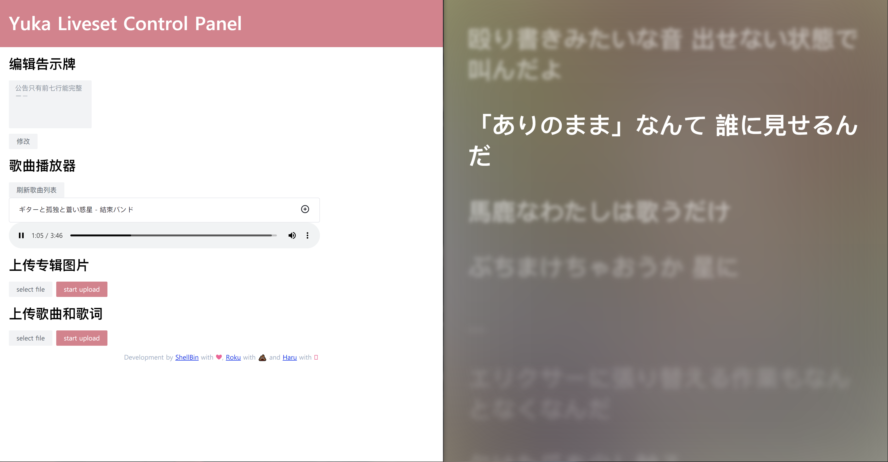

# Yuka Liveset Overdose

用于配合直播间 Unity 工程使用的直播套件（Unity 工程项目地址待补充

控制台和歌词效果图：



配合 Unity 端的演示视频：

https://static.shellbin.me/rsndm.mp4


# 介绍

本项目分为前后端两个部分：

## 前端

```bash
# 进入前端文件夹
cd frontend
# 安装依赖
npm install
# 运行
npm run dev
```

## 后端

打开终端
```bash
# 进入后端文件夹
cd backend
# 安装依赖
npm install
# 实时生成 js 代码
npm run watch
```

打开第二个终端
```bash
# 进入后端文件夹
cd backend
# 生成 js 代码后运行后端服务
node ./dist/index.js
```


## 前端路由对应页面

| 页面   | 路由        |
|------|-----------|
| 专辑封面 | /album    |
| 公告   | /bulletin |
| 歌词   | /lyric    |
